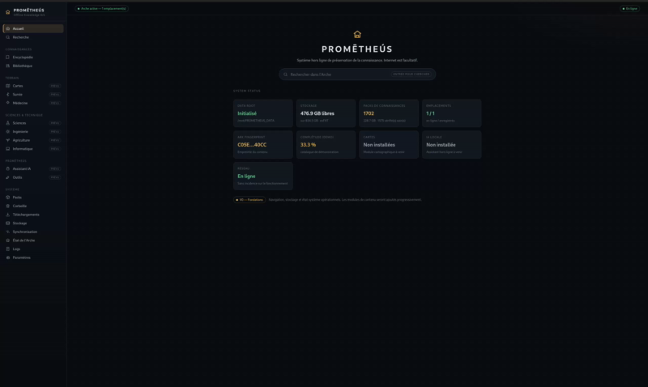
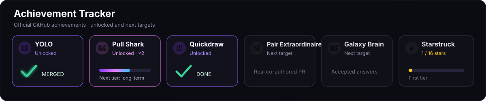

 

**Full-stack · Systems · Cybersecurity · AI**

5th-year Computer Science student at **Epitech Paris**.  
I like building ambitious software, exploring how systems work, and turning experiments into real products.

## About me

- Building **local-first desktop software**, system tools and technical experiments.
- Interested in **full-stack development, cybersecurity, AI and systems engineering**.
- Comfortable moving between product UI, native code, tooling, automation and lower-level system concerns.
- Currently expanding a portfolio of personal projects while finishing my fifth year at Epitech.

## Currently working on

**PROMĒTHEÚS** is a private, offline-first knowledge and survival suite designed around maps, search, routing, local data and resilient access to information. It is still **in development**, so there is no public repository yet.

## Featured projects

### FourTout

**196 tools · 12 categories · one local desktop app.**  
A privacy-first toolbox for PDF, images, audio, video, documents, files, developer utilities, diagnostics and security — built with **Tauri 2, Rust, React 19 and TypeScript**.

[View repository](https://github.com/lolmath06/FourTout)

---

### PULSE

A cross-platform system monitor for **Windows and Fedora Linux** with live metrics, local history, composable dashboards, process inspection and desktop overlays — powered by **Rust, Tauri 2, React and SQLite**.

[View repository](https://github.com/lolmath06/PULSE)

---

### Backrooms Mod

A Minecraft Backrooms project focused on custom environments, structures, visual effects, world generation and modded gameplay using **Java / NeoForge**.

## Tech stack

<table>
<tr>
<td width="25%" valign="top">

### Languages

</td>
<td width="25%" valign="top">

### Frontend

</td>
<td width="25%" valign="top">

### Backend & Data

</td>
<td width="25%" valign="top">

### Desktop & Systems

</td>
</tr>
<tr>
<td valign="top">

### DevOps

</td>
<td valign="top">

### AI / Vision

</td>
<td valign="top">

### Tools

</td>
<td valign="top">

### Areas
`full-stack` · `systems`  
`cybersecurity` · `AI`  
`desktop` · `local-first`  
`game modding`

</td>
</tr>
</table>

## GitHub stats

 

 

## Achievements

**Unlocked:** YOLO · Pull Shark ×2 · Quickdraw  
**Next legitimate targets:** Pair Extraordinaire · Galaxy Brain · Starstruck

Achievement rules are controlled by GitHub and may change. The tracker intentionally avoids fabricated activity or fake co-authorship.

### Build. Learn. Ship. Repeat.

Profile designed around real projects, real activity and a dark Graphite Violet identity.

